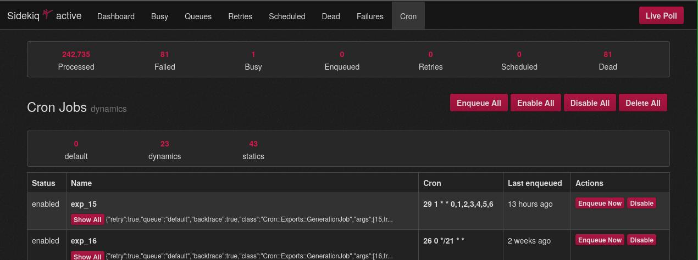

[](https://badge.fury.io/rb/sidekiq-cron)
[](https://github.com/sidekiq-cron/sidekiq-cron/actions)
[](https://codecov.io/gh/sidekiq-cron/sidekiq-cron)

> A scheduling add-on for [Sidekiq](https://sidekiq.org/)

🎬 [Introduction video about Sidekiq-Cron by Drifting Ruby](https://www.driftingruby.com/episodes/periodic-tasks-with-sidekiq-cron)

Sidekiq-Cron runs a thread alongside Sidekiq workers to schedule jobs at specified times (using cron notation `* * * * *` parsed by [Fugit](https://github.com/floraison/fugit)).

Checks for new jobs to schedule every 30 seconds and doesn't schedule the same job multiple times when more than one Sidekiq process is running.

Scheduling jobs are added only when at least one Sidekiq process is running, but it is safe to use Sidekiq-Cron in environments where multiple Sidekiq processes or nodes are running.

If you want to know how scheduling work, check out [under the hood](#under-the-hood).

Works with ActiveJob (Rails 4.2+).

You don't need Sidekiq PRO, you can use this gem with plain Sidekiq.

## Changelog

Before upgrading to a new version, please read our [Changelog](CHANGELOG.md).

## Installation

Install the gem:

```
$ gem install sidekiq-cron
```

Or add to your `Gemfile` and run `bundle install`:

```ruby
gem "sidekiq-cron"
```

**NOTE** If you are not using Rails, you need to add `require 'sidekiq-cron'` somewhere after `require 'sidekiq'`.

## Getting Started

### Job properties

```ruby
{
  # MANDATORY
  'name' => 'name_of_job', # must be uniq!
  'cron' => '1 * * * *',  # execute at 1 minute of every hour, ex: 12:01, 13:01, 14:01, ...
  'class' => 'MyClass',
  # OPTIONAL
  'namespace' => 'YourNamespace', # groups jobs together in a namespace (Default value is 'default'),
  'source' => 'dynamic', # source of the job, `schedule`/`dynamic` (default: `dynamic`)
  'queue' => 'name of queue',
  'args' => '[Array or Hash] of arguments which will be passed to perform method',
  'date_as_argument' => true, # add the time of execution as last argument of the perform method
  'active_job' => true,  # enqueue job through Rails 4.2+ Active Job interface
  'queue_name_prefix' => 'prefix', # Rails 4.2+ Active Job queue with prefix
  'queue_name_delimiter' => '.', # Rails 4.2+ Active Job queue with custom delimiter (default: '_')
  'description' => 'A sentence describing what work this job performs'
  'status' => 'disabled' # default: enabled
}
```

**NOTE** The `status` of a job does not get changed in Redis when a job gets reloaded unless the `status` property is explicitly set.

### Time, cron and Sidekiq-Cron

For testing your cron notation you can use [crontab.guru](https://crontab.guru).

Sidekiq-Cron uses [Fugit](https://github.com/floraison/fugit) to parse the cronline. So please, check Fugit documentation for further information about allowed formats.

If using Rails, this is evaluated against the timezone configured in Rails, otherwise the default is UTC.

If you want to have your jobs enqueued based on a different time zone you can specify a timezone in the cronline,
like this `'0 22 * * 1-5 America/Chicago'`.

#### Natural-language formats

Since sidekiq-cron `v1.7.0`, you can use the natural-language formats supported by Fugit, such as:

```rb
"every day at five" # => '0 5 * * *'
"every 3 hours"     # => '0 */3 * * *'
```

See [the relevant part of Fugit documentation](https://github.com/floraison/fugit#fugitnat) for details.

There are multiple modes that determine how natural-language cron strings will be parsed.

1. `:single` (default)

```ruby
Sidekiq::Cron.configure do |config|
  # Note: This doesn't need to be specified since it's the default.
  config.natural_cron_parsing_mode = :single
end
```

This parses the first possible cron line from the given string and then ignores any additional cron lines.

Ex. `every day at 3:15 and 4:30`

- Equivalent to `15 3 * * *`.
- `30 4 * * *` gets ignored.

2. `:strict`

```ruby
Sidekiq::Cron.configure do |config|
  config.natural_cron_parsing_mode = :strict
end
```

This throws an error if the given string would be parsed into multiple cron lines.

Ex. `every day at 3:15 and 4:30`

- Would throw an error and the associated cron job would be invalid

#### Second-precision (sub-minute) cronlines

In addition to the standard 5-parameter cronline format, sidekiq-cron supports scheduling jobs with second-precision using a modified 6-parameter cronline format:

`Seconds Minutes Hours Days Months DayOfWeek`

For example: `"*/30 * * * * *"` would schedule a job to run every 30 seconds.

Note that if you plan to schedule jobs with second precision you may need to override the default schedule poll interval so it is lower than the interval of your jobs:

```ruby
Sidekiq::Options[:cron_poll_interval] = 10
```

The default value at time of writing is 30 seconds. See [under the hood](#under-the-hood) for more details.

### Namespacing

#### Default namespace

When not giving a namespace, the `default` one will be used.

In the case you'd like to change this value, create a new initializer like so:

`config/initializers/sidekiq-cron.rb`:

```ruby
Sidekiq::Cron.configure do |config|
  config.default_namespace = 'statics'
end
```

#### Usage

When creating a new job, you can optionally give a `namespace` attribute, and then you can pass it too in the `find` or `destroy` methods.

```ruby
Sidekiq::Cron::Job.create(
  name: 'Hard worker - every 5min',
  namespace: 'Foo',
  cron: '*/5 * * * *',
  class: 'HardWorker'
)
# INFO: Cron Jobs - add job with name Hard worker - every 5min in the namespace Foo

# Without specifying the namespace, Sidekiq::Cron use the `default` one, therefore `count` return 0.
Sidekiq::Cron::Job.count
#=> 0

# Searching in the job's namespace returns 1.
Sidekiq::Cron::Job.count 'Foo'
#=> 1

# Same applies to `all`. Without a namespace, no jobs found.
Sidekiq::Cron::Job.all

# But giving the job's namespace returns it.
Sidekiq::Cron::Job.all 'Foo'
#=> [#<Sidekiq::Cron::Job:0x00007f7848a326a0 ... @name="Hard worker - every 5min", @namespace="Foo", @cron="*/5 * * * *", @klass="HardWorker", @status="enabled" ... >]

# If you'd like to get all the jobs across all the namespaces then pass an asterisk:
Sidekiq::Cron::Job.all '*'
#=> [#<Sidekiq::Cron::Job ...>]

job = Sidekiq::Cron::Job.find('Hard worker - every 5min', 'Foo').first
job.destroy
# INFO: Cron Jobs - deleted job with name Hard worker - every 5min from namespace Foo
#=> true
```

### What objects/classes can be scheduled

#### Sidekiq Worker

In this example, we are using `HardWorker` which looks like:

```ruby
class HardWorker
  include Sidekiq::Worker

  def perform(*args)
    # do something
  end
end
```

For Sidekiq workers, `symbolize_args: true` in `Sidekiq::Cron::Job.create` or in Hash configuration is gonna be ignored as Sidekiq currently only allows for [simple JSON datatypes](https://github.com/sidekiq/sidekiq/wiki/The-Basics#:~:text=These%20two%20methods,not%20serialize%20properly.).

#### Active Job

You can schedule `ExampleJob` which looks like:

```ruby
class ExampleJob < ActiveJob::Base
  queue_as :default

  def perform(*args)
    # Do something
  end
end
```

For Active jobs you can use `symbolize_args: true` in `Sidekiq::Cron::Job.create` or in Hash configuration,
which will ensure that arguments you are passing to it will be symbolized when passed back to `perform` method in worker.

### Adding Cron jobs

Refer to [Schedule vs Dynamic jobs](#schedule-vs-dynamic-jobs) to understand the difference.

```ruby
class HardWorker
  include Sidekiq::Worker

  def perform(name, count)
    # do something
  end
end

Sidekiq::Cron::Job.create(name: 'Hard worker - every 5min', cron: '*/5 * * * *', class: 'HardWorker') # execute at every 5 minutes
# => true
```

`create` method will return only true/false if job was saved or not.

```ruby
job = Sidekiq::Cron::Job.new(name: 'Hard worker - every 5min', cron: '*/5 * * * *', class: 'HardWorker')

if job.valid?
  job.save
else
  puts job.errors
end

# or simple
unless job.save
  puts job.errors # will return array of errors
end
```

Use ActiveRecord models as arguments:

```rb
class Person < ApplicationRecord
end

class HardWorker < ActiveJob::Base
  queue_as :default

  def perform(person)
    puts "person: #{person}"
  end
end

person = Person.create(id: 1)
Sidekiq::Cron::Job.create(name: 'Hard worker - every 5min', cron: '*/5 * * * *', class: 'HardWorker', args: person)
# => true
```

Load more jobs from hash:

```ruby
hash = {
  'name_of_job' => {
    'class' => 'MyClass',
    'cron'  => '1 * * * *',
    'args'  => '(OPTIONAL) [Array or Hash]'
  },
  'My super iber cool job' => {
    'class' => 'SecondClass',
    'cron'  => '*/5 * * * *'
  }
}

Sidekiq::Cron::Job.load_from_hash hash
```

Load more jobs from array:

```ruby
array = [
  {
    'name'  => 'name_of_job',
    'class' => 'MyClass',
    'cron'  => '1 * * * *',
    'args'  => '(OPTIONAL) [Array or Hash]'
  },
  {
    'name'  => 'Cool Job for Second Class',
    'class' => 'SecondClass',
    'cron'  => '*/5 * * * *'
  }
]

Sidekiq::Cron::Job.load_from_array array
```

Bang-suffixed methods will remove jobs where source is `schedule` and are not present in the given hash/array, update jobs that have the same names, and create new ones when the names are previously unknown.

```ruby
Sidekiq::Cron::Job.load_from_hash! hash
Sidekiq::Cron::Job.load_from_array! array
```

### Loading jobs from schedule file

You can also load multiple jobs from a YAML (same notation as `Resque-scheduler`) file:

```yaml
# config/schedule.yml

my_first_job:
  cron: "*/5 * * * *"
  class: "HardWorker"
  queue: hard_worker

second_job:
  cron: "*/30 * * * *" # execute at every 30 minutes
  class: "HardWorker"
  queue: hard_worker_long
  args:
    hard: "stuff"
```

There are multiple ways to load the jobs from a YAML file

1. The gem will automatically load the jobs mentioned in `config/schedule.yml` file (it supports ERB)
2. When you want to load jobs from a different filename, mention the filename in sidekiq configuration, i.e. `cron_schedule_file: "config/users_schedule.yml"`
3. Load the file manually as follows:

```ruby
# config/initializers/sidekiq.rb

Sidekiq.configure_server do |config|
  config.on(:startup) do
    schedule_file = "config/users_schedule.yml"

    if File.exist?(schedule_file)
      schedule = YAML.load_file(schedule_file)

      Sidekiq::Cron::Job.load_from_hash!(schedule, source: "schedule")
    end
  end
end
```

### Finding jobs

```ruby
# return array of all jobs
Sidekiq::Cron::Job.all

# return one job by its unique name - case sensitive
Sidekiq::Cron::Job.find "Job Name"

# return one job by its unique name - you can use hash with 'name' key
Sidekiq::Cron::Job.find name: "Job Name"

# if job can't be found nil is returned
```

### Destroy jobs

```ruby
# destroy all jobs
Sidekiq::Cron::Job.destroy_all!

# destroy job by its name
Sidekiq::Cron::Job.destroy "Job Name"

# destroy found job
Sidekiq::Cron::Job.find('Job name').destroy
```

### Work with job

```ruby
job = Sidekiq::Cron::Job.find('Job name')

# disable cron scheduling
job.disable!

# enable cron scheduling
job.enable!

# get status of job:
job.status
# => enabled/disabled

# enqueue job right now!
job.enque!
```

### Schedule vs Dynamic jobs

There are two potential job sources: `schedule` and `dynamic`.
Jobs associated with schedule files are labeled as `schedule` as their source,
whereas jobs created at runtime without the `source=schedule` argument are classified as `dynamic`.

The key distinction lies in how these jobs are managed.
When a schedule is loaded, any stale `schedule` jobs are automatically removed to ensure synchronization within the schedule.
The `dynamic` jobs remain unaffected by this process.

### How to start scheduling?

Just start Sidekiq workers by running:

```
$ bundle exec sidekiq
```

### Web UI for Cron Jobs

If you are using Sidekiq's web UI and you would like to add cron jobs too to this web UI,
add `require 'sidekiq/cron/web'` after `require 'sidekiq/web'`.

With this, you will get:



## Under the hood

When you start the Sidekiq process, it starts one thread with `Sidekiq::Poller` instance, which perform the adding of scheduled jobs to queues, retries etc.

Sidekiq-Cron adds itself into this start procedure and starts another thread with `Sidekiq::Cron::Poller` which checks all enabled Sidekiq cron jobs every 30 seconds, if they should be added to queue (their cronline matches time of check).

Sidekiq-Cron is checking jobs to be enqueued every 30s by default, you can change it by setting:

```ruby
Sidekiq::Options[:cron_poll_interval] = 10
```

Sidekiq-Cron is safe to use with multiple Sidekiq processes or nodes. It uses a Redis sorted set to determine that only the first process who asks can enqueue scheduled jobs into the queue.

When running with many Sidekiq processes, the polling can add significant load to Redis. You can disable polling on some processes by setting `Sidekiq::Options[:cron_poll_interval] = 0` on these processes.

## Contributing

**Thanks to all [contributors](https://github.com/sidekiq-cron/sidekiq-cron/graphs/contributors), you’re awesome and this wouldn’t be possible without you!**

* Check out the latest master to make sure the feature hasn't been implemented or the bug hasn't been fixed yet.
* Check out the issue tracker to make sure someone already hasn't requested it and/or contributed it.
* Fork the project.
* Start a feature/bugfix branch.
* Commit and push until you are happy with your contribution.
* Make sure to add tests for it. This is important so we don't break it in a future version unintentionally.
* Open a pull request!

### Testing

You can execute the test suite by running:

```
$ bundle exec rake test
```

### Using Docker

[Docker](https://www.docker.com) allows you to run things in containers easing the development process.

This project uses [Docker Compose](https://docs.docker.com/compose/) in order to orchestrate containers and get the test suite running on you local machine, and here you find the commands to run in order to get a complete environment to build and test this gem:

1. Build the Docker image (only the first time):
```
docker compose -f docker/docker-compose.yml build
```
2. Run the test suite:
```
docker compose -f docker/docker-compose.yml run --rm tests
```
_This command will download the first time the project's dependencies (Redis so far), create the containers and run the default command to run the tests._

#### Running other commands

In the case you need to run a command in the gem's container, you would do it like so:

```
docker compose -f docker/docker-compose.yml run --rm tests <HERE IS YOUR COMMAND>
```
_Note that `tests` is the Docker Compose service name defined in the `docker/docker-compose.yml` file._

#### Running a single test file

Given you only want to run the tests from the `test/unit/web_extension_test.rb` file, you need to pass its path with the `TEST` env variable, so here is the command:

```
docker compose -f docker/docker-compose.yml run --rm --env TEST=test/unit/web_extension_test.rb tests
```

## License

Copyright (c) 2013 Ondrej Bartas. See [LICENSE](LICENSE.txt) for further details.
